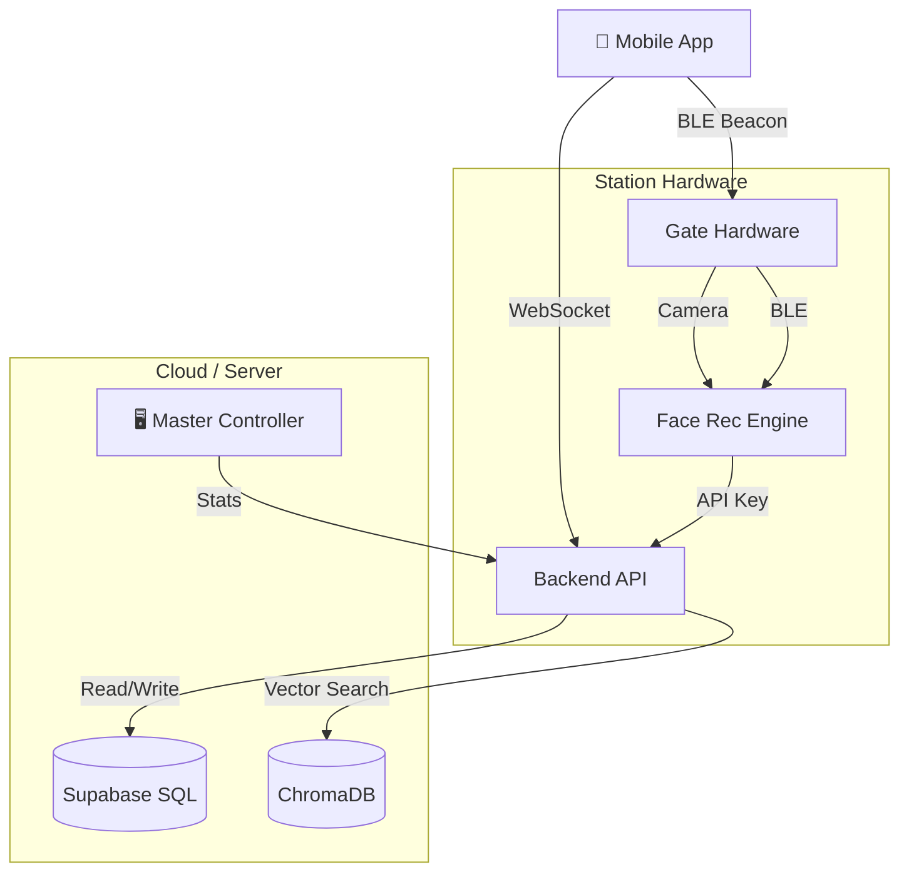

# 🚇 Metro Gate System (Face + BLE)

A contactless biometric entry/exit system for metro stations, featuring Face Recognition and Bluetooth Low Energy (BLE) beacon detection.

  [](https://metro-dashboard-eight.vercel.app/)

## 🌟 Features

- **Dual-Factor Auth**: Face Verification (Dlib) + BLE Signal (Phone as Beacon).
- **Contactless Entry**: No tapping required; just walk through.
- **Auto-Fare Calculation**: Fare calculated based on Entry and Exit stations (Distance-based).
- **Master Controller**: Real-time dashboard for station managers (Revenue, Traffic, Alerts).
- **Mobile App**: React Native (Expo) app for identity management, wallet top-up, and trip history.

---

## 🏗️ Architecture



---

## 🚀 Setup Guide

### 1. Prerequisites
- **Python 3.9+**
- **Node.js 16+** (for App)
- **Supabase Account** (PostgreSQL)
- **Hardware**: Webcam + ESP32 (for BLE) _(Optional: can be simulated)_

### 2. Database Setup (Supabase)

Run the following SQL in your Supabase SQL Editor to set up the tables:

```sql
-- 1. Profiles (Users)
CREATE TABLE public.profiles (
  id uuid NOT NULL,
  full_name text,
  wallet_balance integer DEFAULT 100,
  face_url text,
  cypher_id text UNIQUE,
  is_flagged boolean DEFAULT false,
  created_at timestamp with time zone NOT NULL DEFAULT timezone('utc'::text, now()),
  is_enrolled boolean DEFAULT false,
  CONSTRAINT profiles_pkey PRIMARY KEY (id)
);

-- 2. Stations (Metadata)
CREATE TABLE public.stations (
  id integer NOT NULL DEFAULT nextval('stations_id_seq'::regclass),
  name text NOT NULL,
  status text DEFAULT 'ACTIVE'::text,
  CONSTRAINT stations_pkey PRIMARY KEY (id)
);

-- 3. Trips (History)
CREATE TABLE public.trips (
  id uuid NOT NULL DEFAULT gen_random_uuid(),
  user_id uuid,
  station_name text,
  entry_time timestamp with time zone DEFAULT timezone('utc'::text, now()),
  exit_time timestamp with time zone,
  exit_station text,
  fare_charged integer DEFAULT 0,
  access_granted boolean DEFAULT true,
  status text DEFAULT 'COMPLETED'::text,
  CONSTRAINT trips_pkey PRIMARY KEY (id),
  CONSTRAINT trips_user_id_fkey FOREIGN KEY (user_id) REFERENCES public.profiles(id)
);

-- Note: Enable RLS (Row Level Security) if deploying to production!
```

### 3. Backend Setup

```bash
cd backend
python3 -m venv venv
source venv/bin/activate  # Windows: venv\Scripts\activate
pip install -r requirements.txt
```

**Configuration (`.env` in root)**:
Create a `.env` file in the project root:
```ini
SUPABASE_URL=https://your-project.supabase.co
SUPABASE_SERVICE_KEY=your-service-role-key
```

### 4. Mobile App Setup

```bash
cd app
npm install
npx expo start
```
- Scan the QR code with Expo Go (Android/iOS).

---

## 🖥️ Running the System

You will need **3 Terminal Windows**:

### Terminal 1: Backend API
Authentication, User Management, and Trip Logic.
```bash
cd backend
uvicorn main:app --reload --port 8000
```

### Terminal 2: Master Controller (Backend)
Real-time stats API. (The UI is now hosted separately).
```bash
# In project root
uvicorn master:app --reload --port 8001
```
👉 Open Live Dashboard: [https://metro-dashboard-eight.vercel.app/](https://metro-dashboard-eight.vercel.app/)

### Terminal 3: Gate Script (Entry/Exit)
Simulates the physical gate hardware (Camera + BLE).

**To run Exit Gate:**
```bash
# In project root
python3 exit.py
```

**To run Entry Gate:**
1. Edit `config.py`: Set `GATE_MODE = "ENTRY"`
2. Run:
```bash
python3 main.py
```

---

## � Secrets & Configuration

### `config.py` (Hardware Config)
Controls hardware settings for the Python scripts.
- `SERIAL_PORT`: Path to ESP32 (e.g., `/dev/cu.usbserial...` or `COM3`)
- `CAMERA_INDEX`: webcam ID (0 or 1)
- `GATE_MODE`: "ENTRY" or "EXIT"
- `STATION_NAME`: Name of the station (must match `FARE_TABLE` in `backend/main.py`)

### API Keys
- **Gate API Key**: Hardcoded in `backend/main.py` and scripts as `gk_live_xxxxxxxxxxxxxx`. Update this for production.
- **Supabase Keys**: Managed via `.env`.

---

## 🛠️ API Reference

| Method | Endpoint | Description | Auth |
|--------|----------|-------------|------|
| **POST** | `/gate/access` | Entry gate logic (Check Balance, Record Entry) | Gate Key |
| **POST** | `/gate/exit` | Exit gate logic (Calc Fare, Deduct, Close Trip) | Gate Key |
| **GET** | `/profile` | Get user profile & balance | User JWT |
| **GET** | `/trips` | Get user trip history | User JWT |
| **WS** | `/ws/capture/...` | Face Enrollment Stream | None |

---

## 🐞 Troubleshooting

- **Camera not opening?** Check `config.py` → `CAMERA_INDEX`.
- **Serial Error?** Check if ESP32 is plugged in and `SERIAL_PORT` is correct.
- **"User not found"?** Ensure the user is **Enrolled** in the App and has a `cypher_id`.
- **Supabase Error?** Verify `SUPABASE_URL` and `SUPABASE_SERVICE_KEY` in `.env`.

---

_Built with ❤️ for Metro Gate Systems_
